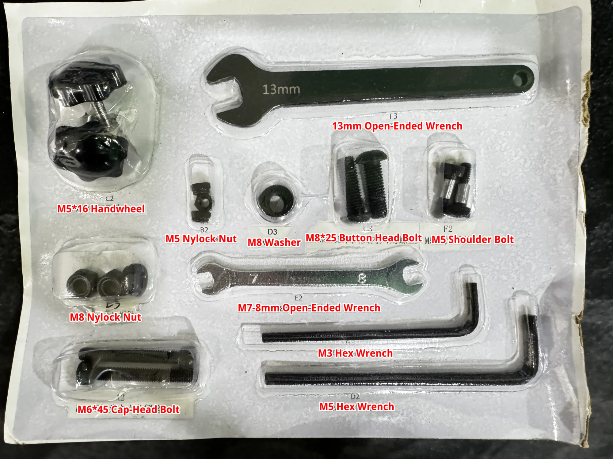

# Assembly Yaw Ultimate Edition by ShallXR

The **ShallXR Yaw Ultimate Edition** is a significantly refined and upgraded version of the original Yaw 2, addressing the various issues that affected the earlier model. According to ShallXR themselves, the team has implemented **over 100 design improvements** to deliver a more reliable, smoother, and overall superior experience.

If you're interested in getting the Yaw Ultimate Edition, you can save $100 at checkout with the discount code **`VRK100`**, or simply use this direct link:

- <a href="https://shallxr.com/collections/yaw-vr-motion-chair/products/yawvr-ultimate-powered-by-shallxr?ref=ItsVRK" target="_blank">https://shallxr.com/collections/yaw-vr-motion-chair/products/yawvr-ultimate-powered-by-shallxr?ref=ItsVRK</a>

  <iframe src="https://www.youtube.com/embed/80WE85j5zQI?si=4ug7gNMuplDCzs8i" title="YouTube video player" frameborder="0" allow="accelerometer; autoplay; clipboard-write; encrypted-media; gyroscope; picture-in-picture; web-share" referrerpolicy="strict-origin-when-cross-origin" allowfullscreen></iframe>

## Toolkit Translation

## Warnings

TO AVOID DAMAGE TO THE SIMULATOR 
Please begin with axis limits and gradually increase the motion range step by step, exercising caution. 
We recommend starting limit of 12° on each axis and starting power of 30%.

Before You Exit the Simulator 
Ensure you either push the “STOP” button or turn off the power switch to prevent any potential issues.

