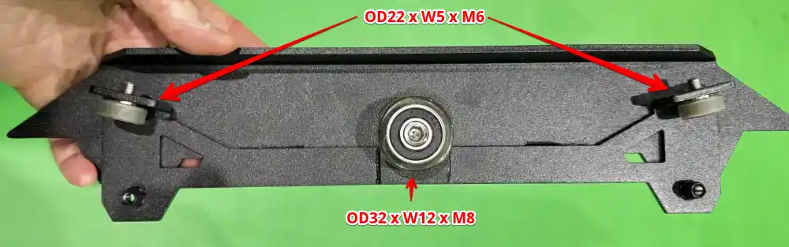
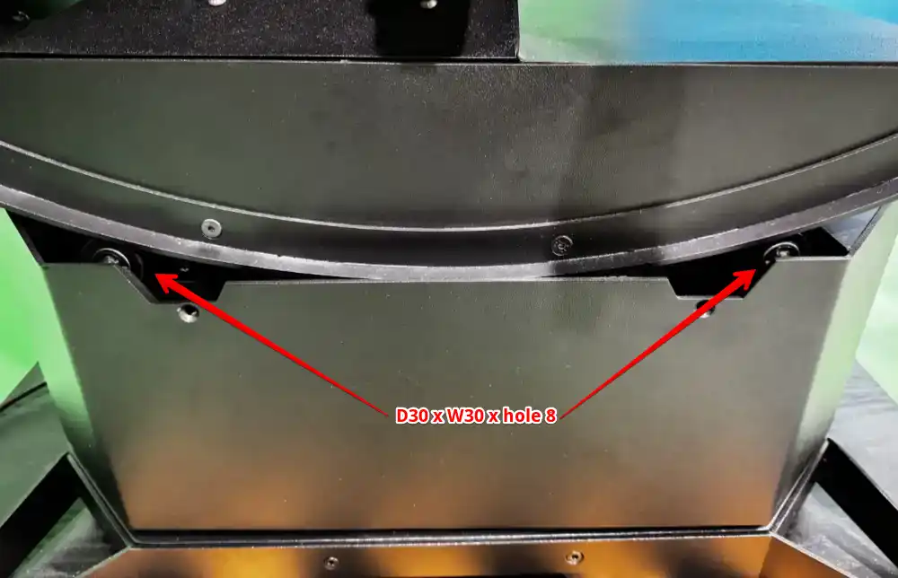
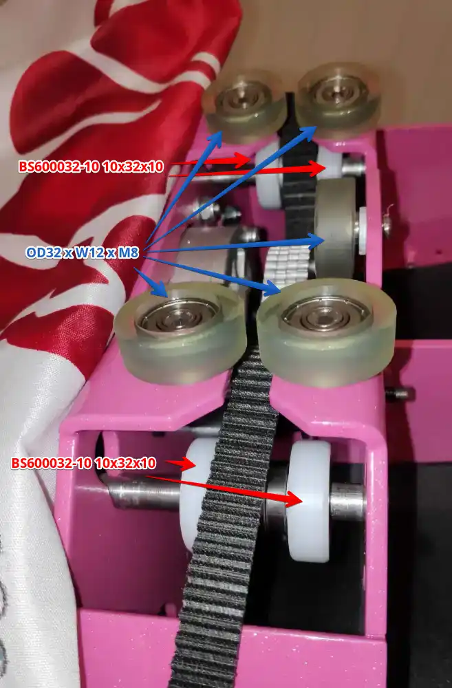
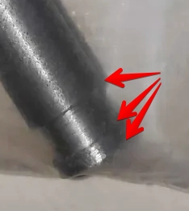

# Yaw 3 - Spare Parts Links

## Rollers
Make sure you select the correct size when ordering each item!

### Pitch

4 * <a href="https://s.click.aliexpress.com/e/_c3yu8eVv" target="_blank">OD22 x W5 x M6 PU Coated Roller</a> 
2 outer rollers per side, see image above (order quantity of 4)

2 * <a href="https://s.click.aliexpress.com/e/_c3ZDakE7" target="_blank">OD32 x W12 x M8 Polyurethane Covered Roller</a> 
one central per side, see image above (order quantity of 7 to cover both Pitch and Roll)

4 * <a href="https://s.click.aliexpress.com/e/_c4PCuVRp" target="_blank">D30 x W30 x hole 8 PU polyurethane coated</a> 
load bearing rollers indicated in image below (order quantity of 4)

### Roll

4 * <a href="https://s.click.aliexpress.com/e/_c33WQYOj" target="_blank">BS600032-10 10x32x10 POM Wheels</a> 
white rollers in image above (this link is a bag of 4, so order quantity of 1)

5 * <a href="https://s.click.aliexpress.com/e/_c3ZDakE7" target="_blank">OD32 x W12 x M8 Polyurethane Covered Roller</a> 
non-white rollers in image above (order quantity of 7 to cover both Pitch and Roll)

- If you've had issue with PU cover separating from original bearings, optionally replace rear two rollers with <a href="https://s.click.aliexpress.com/e/_c4MBNpBv" target="_blank">8x32x12 mm POM Coated Rollers</a> which will also each require a <a href="https://s.click.aliexpress.com/e/_c38qyRFh" target="_blank">M8x15x2 washer</a> and <a href="https://s.click.aliexpress.com/e/_c4Bzh75l" target="_blank">M8x18mm Black Hex Hexagon Socket Button Head Bolt</a>

You may need to slightly sand/grind the outside ends of shaft to get the existing bearings off that will be replaced with POM bearings 

## Tools
<a href="https://s.click.aliexpress.com/e/_c3yWGiE3" target="_blank">4-In-1 Circlip Pliers Set</a>

<a href="https://s.click.aliexpress.com/e/_c3DBPWYr" target="_blank">Hex Wrench Set</a> Select option: 10 pcs Ball-end 
3 and 6mm hex keys required to remove existing threaded bearings

<a href="https://s.click.aliexpress.com/e/_c3DBPWYr" target="_blank">Torx Wrench Set</a> Select option: 10 pcs Torx-end 
T25 to remove pitch locking plate
